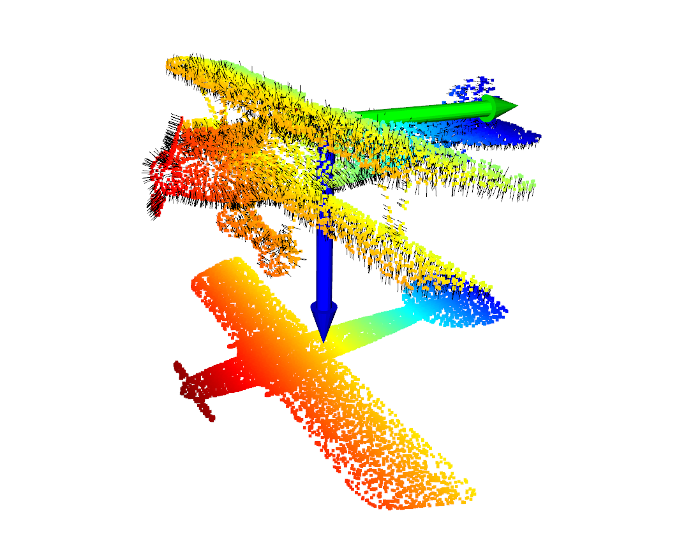
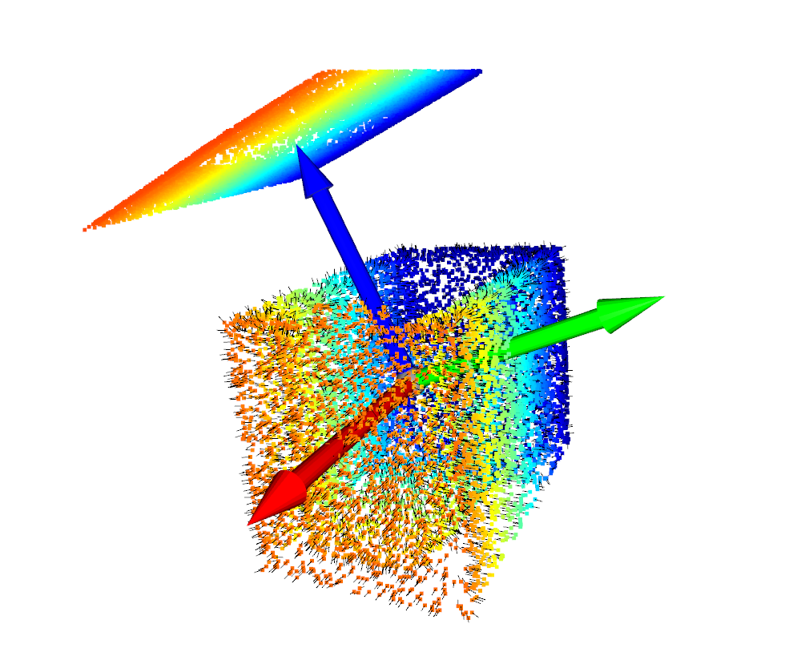
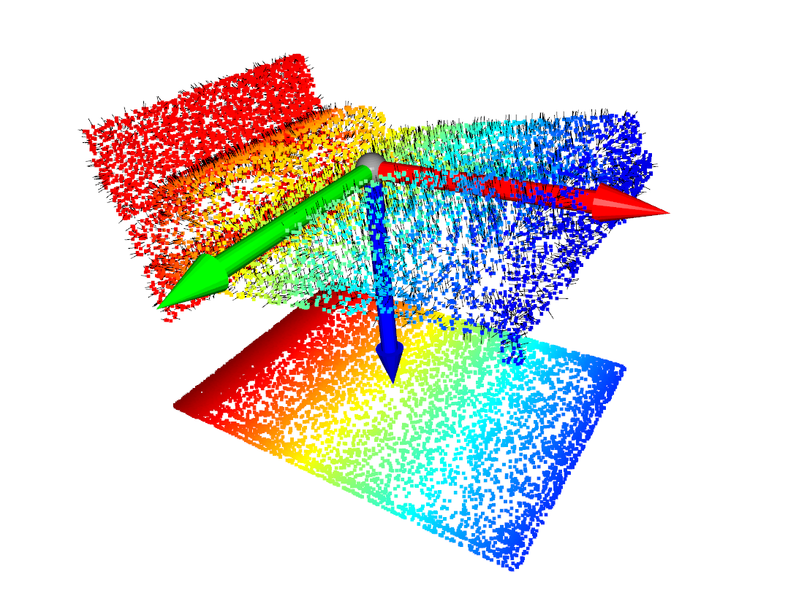

# Homework 1

> by SS47816


## Task 1: PCA

Implementation of PCA in `pca_normal.py`:
```python
# Normalize X by the center
X_ = data - np.mean(data, axis=0)
# Get the H matrix (3x3)
H = np.dot(X_.T, X_)
# Compute SVD of H (Eigenvector of X = Eigenvector of H)
# Get U, Sigma, V* (M = U Sigma V*)
# V.columns are eigenvectors of M*M
# U.columns are eigenvectors of MM*
# Sigma.diagonal elements are non-negative roots of the eigenvalues of MM* and M*M
eigenvectors, eigenvalues, _ = np.linalg.svd(H)
```

1. Normalise the pointcloud data `data` by the model's centroid
2. Formulate the H matrix, which is a 3x3 vector that shares the same eigenvectors and eigenvalues with the original `X_` (and `X_.T`). In this way, the dimension of the target matrix for SVD will be reduced significantly.
3. Conduct the SVD on matrix `H`. Based on the formula M = U Sigma V*, we will be able to retrieve the following:
    * U, whose columns are eigenvectors of MM*
    * Sigma, whose diagonal elements are non-negative roots of the eigenvalues of MM* and M*M
    * V, whose are eigenvectors of M*M


## Task 2: Normal Vector Estimation for points

Implementation of Normal Vector Estimation in `pca_normal.py`:
```python
pcd_tree = o3d.geometry.KDTreeFlann(point_cloud_o3d)
normals = []
N = pointcloud.shape[0]
for index in range(N):
    [_, idx, _] = pcd_tree.search_knn_vector_3d(pc_view.points[index], 21)
    neighbor_pc = np.asarray(pc_view.points)[idx]
    _, v = PCA(neighbor_pc)
    normals.append(v[:, 2])
```


## Visualization of Task 1 & 2





