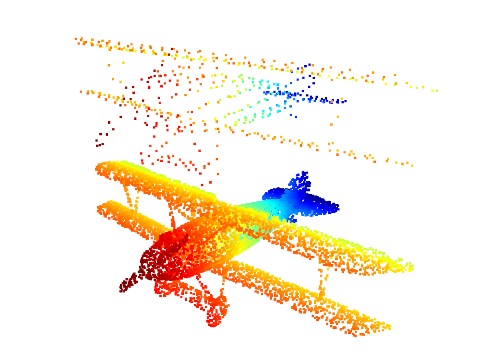
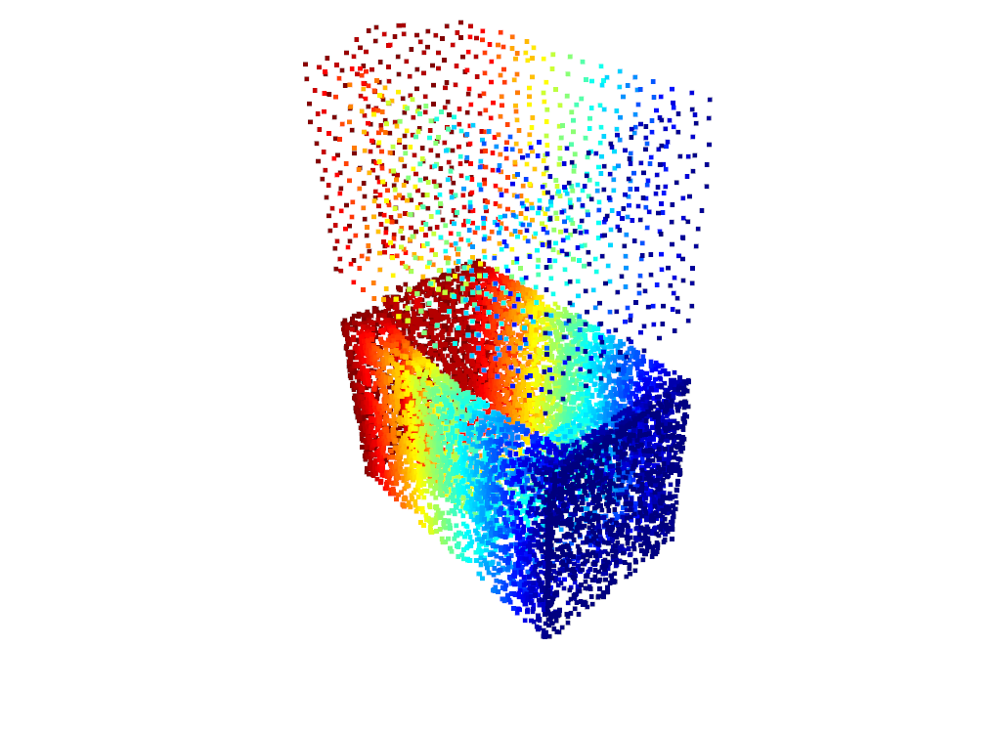
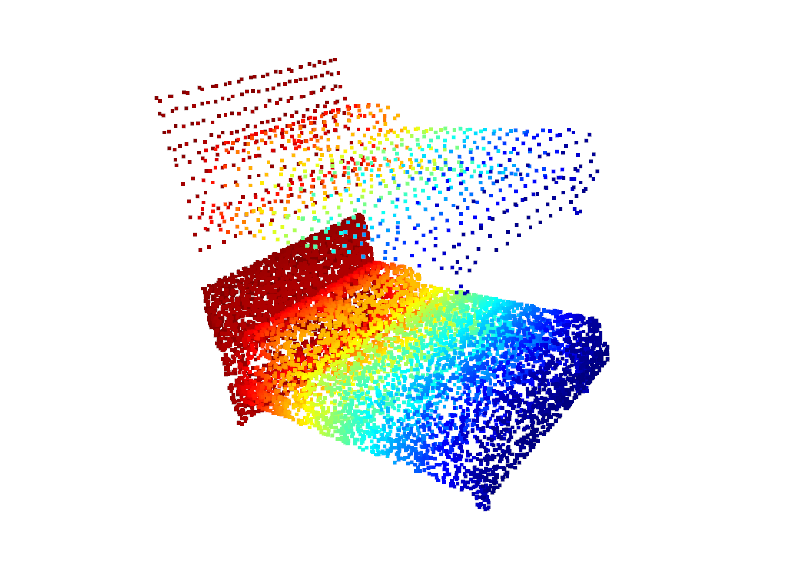

# Homework 1

> by SS47816


## Task 1: PCA

Implementation of PCA in `pca_normal.py`:
```python
# Normalize X by the center
X_ = data - np.mean(data, axis=0)
# Get the H matrix (3x3)
H = np.dot(X_.T, X_)
# Compute SVD of H (Eigenvector of X = Eigenvector of H)
# Get U, Sigma, V* (M = U Sigma V*)
# V.columns are eigenvectors of M*M
# U.columns are eigenvectors of MM*
# Sigma.diagonal elements are non-negative roots of the eigenvalues of MM* and M*M
eigenvectors, eigenvalues, _ = np.linalg.svd(H)
```

1. Normalise the pointcloud data `data` by the model's centroid
2. Formulate the H matrix, which is a 3x3 vector that shares the same eigenvectors and eigenvalues with the original `X_` (and `X_.T`). In this way, the dimension of the target matrix for SVD will be reduced significantly.
3. Conduct the SVD on matrix `H`. Based on the formula M = U Sigma V*, we will be able to retrieve the following:
    * U, whose columns are eigenvectors of MM*
    * Sigma, whose diagonal elements are non-negative roots of the eigenvalues of MM* and M*M
    * V, whose are eigenvectors of M*M


## Task 2: Surface Normal Estimation

Implementation of Normal Vector Estimation in `pca_normal.py`:
```python
pcd_tree = o3d.geometry.KDTreeFlann(point_cloud_o3d)
normals = []
N = pointcloud.shape[0]
for index in range(N):
    [_, idx, _] = pcd_tree.search_knn_vector_3d(pc_view.points[index], 21)
    neighbor_pc = np.asarray(pc_view.points)[idx]
    _, v = PCA(neighbor_pc)
    normals.append(v[:, 2])
```

1. Feed the model pointcloud into a KD-Tree structure for further processing
2. For each point:
   1. find its nearest k neighboring points
   2. Cluster these neighboring points and perform PCA on this region
   3. Select the least significant eigenvector and append it into a list
3. Visualize it

## Visualization of Task 1 & 2


## Task 3: Voxel Grid Down-sampling

Implementation of Normal Vector Estimation in `voxel_filter.py`:

```python
x_min, x_max = np.min(point_cloud[:, 0]), np.max(point_cloud[:, 0])
y_min, y_max = np.min(point_cloud[:, 1]), np.max(point_cloud[:, 1])
z_min, z_max = np.min(point_cloud[:, 2]), np.max(point_cloud[:, 2])

Dx, Dy, Dz = (x_max - x_min)/leaf_size, (y_max - y_min)/leaf_size, (z_max - z_min)/leaf_size

min_vec = np.array([x_min, y_min, z_min])
indices = np.floor((point_cloud.copy() - min_vec)/leaf_size)
index = indices[:, 0] + indices[:, 1]*Dx + indices[:, 2]*Dx*Dy

for i in np.unique(index):
    voxel_points = point_cloud[index==i]
    if method == 'centroid':
        filtered_points.append(np.mean(voxel_points, axis=0))
    else:
        filtered_points.append(voxel_points[np.random.choice(a=voxel_points.shape[0])])
```

1. Compute the size of the Region of Interest
2. Calculate the voxel index for each point
3. Find the points belong to the same voxel grid
4. Determine the final point based on method specified (either `centroid` or `random`)

## Visualization of Task 3







## Comparison Results

Comparison between Self-implemented algorithms with the Open3D versions

**Note:** All results are normalized to the time taken to process 1000 points (in seconds)


### Test 1: PCA

#### My PCA

* 4e-05 second

#### Open3D

* No corresponding function


### Test 2: KDTree Construction

#### My Version

* No corresponding function

#### Open3D `KDTreeFlann`

* 0.00021 second


### Test 3: Surface Normal Estimation

#### My Version

* 0.069 second

#### Open3D

* 0.00066 second (100x faster)


### Test 4: Voxel Down-sampling

#### My Version

* 0.00312 second

#### Open3D

* 5e-05 second (60x faster)


