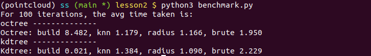
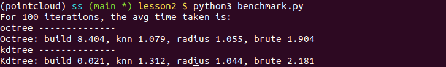
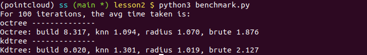

# Homework 2

> by SS47816

NN-Trees

Python implementation of Binary Search Tree, kd-tree for tree building, kNN search, fixed-radius search.


## Benchmarking Result

After 100 iterations, the benchmarking results between Octree and Kdtree is shown as follows:

#### Test 1:

```python
leaf_size = 32
min_extent = 0.0001
k = 8
radius = 1
```



#### Test 2:

```python
leaf_size = 4
min_extent = 0.0001
k = 8
radius = 1
```



#### Test 3:

```python
leaf_size = 32
min_extent = 0.0001
k = 32
radius = 1
```




### Conclusion

1. Building of Octree takes much longer than that of the Kdtree (around 403.9 times slower?!) Possibly this is because of the introduction of increased dimensionality. The much more complicated relationship between the sphere defined by  `worstDist()`and the octant might contributed to this slowdown.
2. Generally speaking, the search methods (knn and radius) both are faster than the brutal force method (faster by around 1.65 to 2.04 times).
3. Changing the hyper-parameters, `leaf_size` and `k` doesn't exert significant influence on the timing results. The search time is pretty consistent on average.