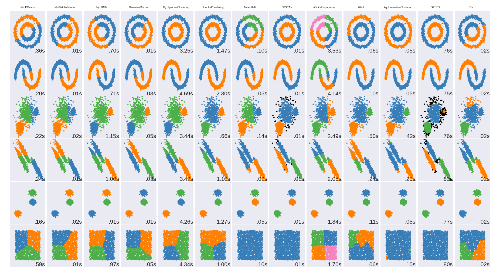

# Homework 3

> by SS47816

Clustering

Python implementation of K-Means, GMM, and Spectral Clustering algorithms.

## Test Result

## Conclusion

1. The self-implementations of the three clustering algorithms (K-Means, GMM, and Spectral Clustering) achieved roughly the same results as the standard versions
2. However, the time taken by each algorithm was much worse than the standard version. Slower by around 2 to 100 times
3. This may due to the following reasons:
   * Unnecessary time/memory expenses, code contains inefficient operations
   * Performed extra number of iterations that are not necessary
   * Lack of carefully designed early stop criteria
   * Difference in initialization step (the standard versions may have designed efficient init steps that could make the algorithms converge faster)