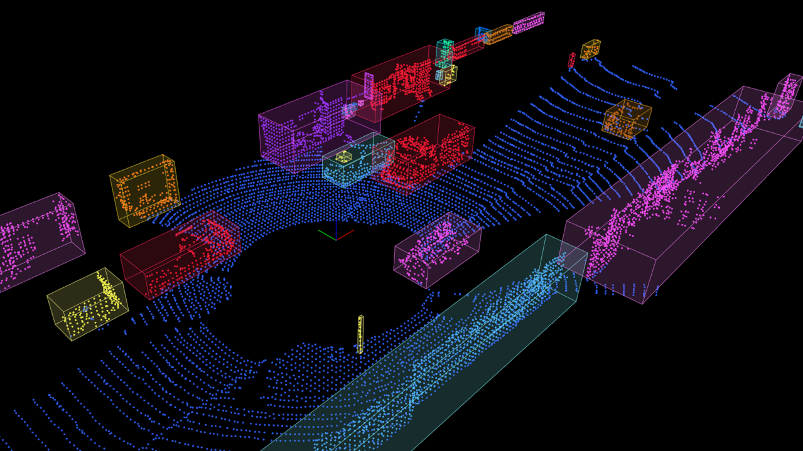

# Homework 4

> by SS47816

Clustering & Model Fitting

A Pipeline for Ground Filtering, Clustering, plus a simple Tracking

## Process Pipeline

1. Read the raw Lidar point-cloud from the KITTI dataset
2. Crop the main Region of Interest (ROI) for further processing (Centre as the Origin, L = 60 m, W = 20 m, H = 3m)
3. Down-sample the cropped point-cloud using Voxel Grid Down-sampling method, with leaf size = 0.2 m
4. Segment the ground plane using the RANSAC, with a max number of iterations of 100 and a threshold of 0.2 m
5. Cluster the foreground points into a series of small clusters and assign them an unique ID & a random color
6. Draw a Bounding Box for each of the clusters

**Additional: Track the same object across frame and keep its color consistent**

7. Use a simple Hungarian method with Bounding Box IOU as a gauge to associate objects between two adjacent time frames (e.g. t = k, t = k+1)

8. For the new objects clustered by **Step 6 **at t = k+1, if it has a corresponding object at t = k, it will be assigned with that ID and painted with the same color as its counterpart

   

## Test Results

The above mentioned pipeline was tested on two KITTI sequences, and the results are presented here: 

#### Videos

Please refer to the `media` folder:

* `media/result-1.mp4`
* `media/result-2.mp4`

#### Screen-shot

