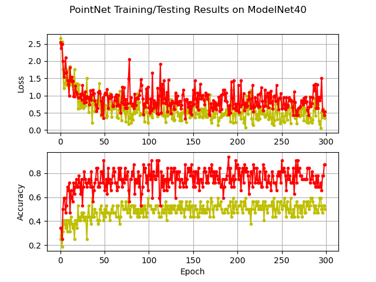

# Homework 5

> by SS47816

Classification on ModelNet40

## Training Process

1. Using the PointNet model from https://github.com/fxia22/pointnet.pytorch with some customized modifications. 
2. The dataset used in this training was the ModelNet40, using its own default arrangement of train and test sets
3. Trained the PointNet on ModelNet40 dataset with various combinations of learning rate, batch size and  nepoch, and finally selected the following hyper parameters to strike a balance between training time and accuracy:
   * learning rate: 1e-04
   * batch size: 32
   * nepochs: 300

## Test Results

The loss, and accuracy during the training are shown in the figure above (with red line representing the results on `train` set, and the yellow line representing the results on `test` set) 

There are several observations:

* The final overall accuracy achieve was around 75.1% on all classes, which is acceptable
* The oscillation of both the loss and the accuracy during the training are quite huge, which indicates that the learning rate may be higher than the ideal value. However, due the limitation in training resources, a learning rate of 1e-04 was selected and shown here. It is desired to have a smaller learning rate if possible. 
* Comparing the loss and the accuracy between train and test set, surprisingly the model achieved a better performance on test set than on the train set. One possible explanation might be that the test set of ModelNet40 has much fewer objects than its train set. Hence, with so little test data, the model accuracy might seems higher than expected if the "difficulty" of the test set is not that high
* The model accuracy can be further improved by introducing data augmentation techniques on pointclouds and trained on data with different number of points