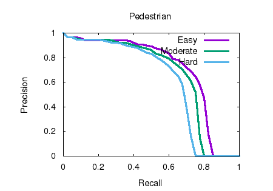

# 3D Pointcloud

## Homework 6: Evaluation of 3D Object Detection Models on KITTI

> by SS47816

---

### Experiment Setup

#### 1. KITTI Evaluation Tool (Thrid Party)

> Cloned From: https://github.com/prclibo/kitti_eval.git

#### 2. KITTI Official Devkit

> From [KITTI Official Website](http://www.cvlibs.net/datasets/kitti/eval_object.php?obj_benchmark=3d)

#### 3. [MMDetection3](https://github.com/open-mmlab/mmdetection3d)

> Installed by following this [official installation guide](https://github.com/open-mmlab/mmdetection3d/blob/master/docs/install.md)

In MMDetection3D, there is a wide range of [pretrained models](https://github.com/open-mmlab/mmdetection3d/blob/master/docs/model_zoo.md) available for 3D object detection tasks. In this experiment, **SECOND** was selected as an example for its relatively high accuarcy performance on KITTI and tolarable GPU Memory footprint (less than 8GB, which is the limit of my GPU)

#### 4. Dataset Preparation

The KITTI dataset was downloaded from the [KITTI Official Website](http://www.cvlibs.net/datasets/kitti/eval_object.php?obj_benchmark=3d) and prepared by following [this guid](https://github.com/open-mmlab/mmdetection3d/blob/master/docs/install.md) by MMDetection3D

---

### Evalutation Result on KITTI

The Precision v.s. Recall curves for the detection results of the 3 classes (Car, Cyclist, and Pedestrain) are shown below:

#### Car

1. Car Detection

   

2. Car Detection 3D

   

3. Car Detection Ground

   

4. Car Orientation

   

#### Cyclist

1. Cyclist Detection

   

2. Cyclist Detection 3D

   

3. Cyclist Detection Ground

   

4. Cyclist Orientation

   

#### Pedestrian

1. Pedestrian Detection

   

2. Pedestrian Detection 3D

   

3. Pedestrian Detection Ground

   

4. Pedestrian Orientation

   

---

### Conclusion

From the above results, it is more than obvious that the AP for the Car class is far higher than that for the Cyclist and the Pedestrain classes. Generally, both the precision and the recall for Cyclists and Pedestrains are lower than that for Cars, especially the recall, contributed the majority of the drop in AP. This might due to several reasons:

* Cars usuals come in larger sizes, which means more Lidar points will evetually fall onto them, making it easier to detect and recognise. While Cyclists and Pedestains tends to be smaller and narrower, it is much harder for the model to recognise them from so little infomation retrived. 
* The training set is imbalanced among classes. KITTI contains much more Car samples comparing to Cyclists and Pedestrains, makes it difficult for the model to learn them as good as cars. 